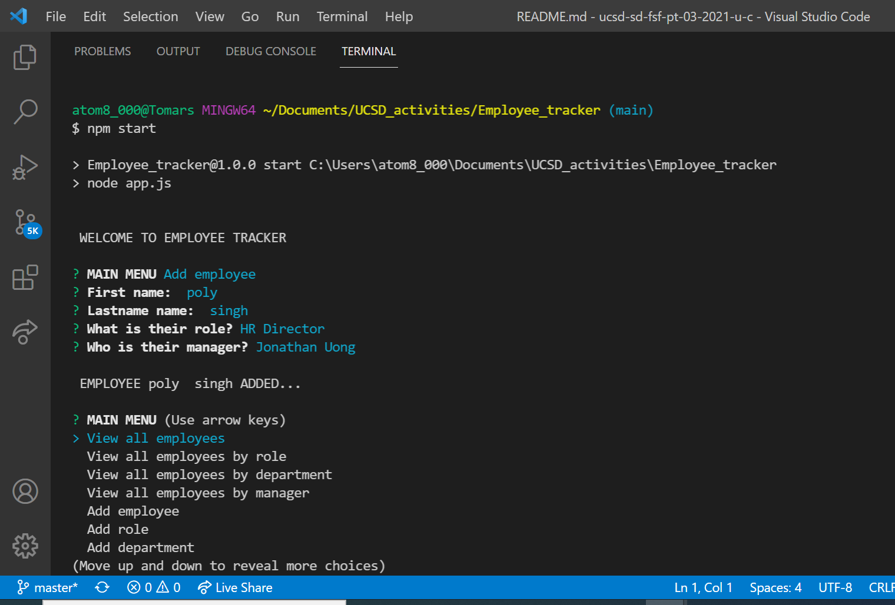

# Employee_tracker

## Description
This is an application for a business owner to view and manage the departments, roles, and employees in the company using node, inquirer, and MySQL.

The application gives following options :

> - View all employees with the option by role, department, or manager
> - Add an employee, role, or department
> - Update an employee role or manager
> - Delete employee, role, or department
> -  View department salary budgets


## Demo:
https://drive.google.com/file/d/1C_JlzqjCCGb1TwvPy55BJbw8rvSfIafo/view 

## User Story

```
As a business owner
I want to be able to view and manage the departments, roles, and employees in my company
So that I can organize and plan my business
```


### Installation
```
Run npm install
Run schema.sql and seeds.sql in workbench
Edit connectionProperties in app.js

```

### Usage

```
Run npm start
Select options from the prompt

```
### Dependencies 
```
npm i inquirer
npm i mysql
npm i console.table
npm i promise-mysql
```
## Github Repo
https://github.com/poly-singh/Employee_tracker 

## Application Snapshots





